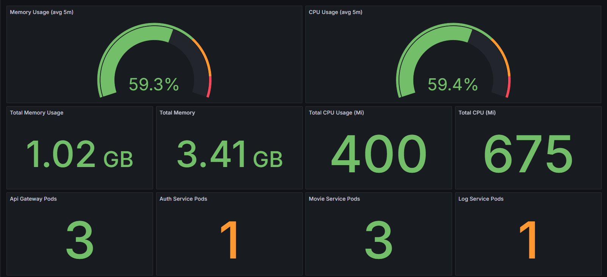
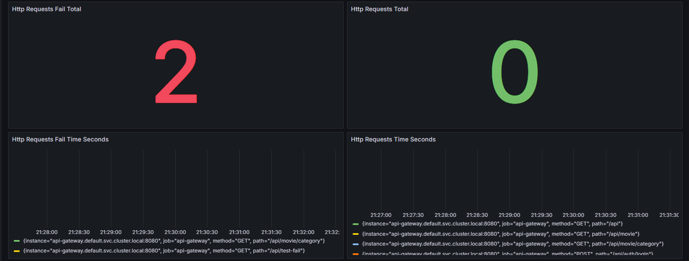
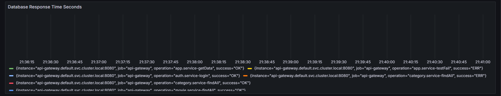

# Monitoring Services with Prometheus and Grafana

This is show how to monitoring your apps with Prometheus and Grafana.

# Installation

1. Create the namespace.

```sh
kubectl create namespace prometheus
```

2. Install kube-prometheus-stack using helm.

```sh
helm repo add prometheus-community https://prometheus-community.github.io/helm-charts
helm repo update
helm install prometheus prometheus-community/kube-prometheus-stack -n prometheus -f k8s/prometheus/prometheus.yaml
```

> if you don't know how to get the values.yaml run this command below:

```sh
sudo apt-get install xclip

helm show values prometheus-community/kube-prometheus-stack | xclip -selection clipboard
```

3. Wait for installation complete (process may takes up to 5-10 minutes).

4. After installation complete, expose the Prometheus and Grafana.

```sh
./k8s/run-prometheus.sh
./k8s/run-grafana.sh
```

---

Dashboard Grafana:

- username: admin
- password: prom-operator

> import k8s/prometheus/NestJSApps.json to Grafana Dashboard.




